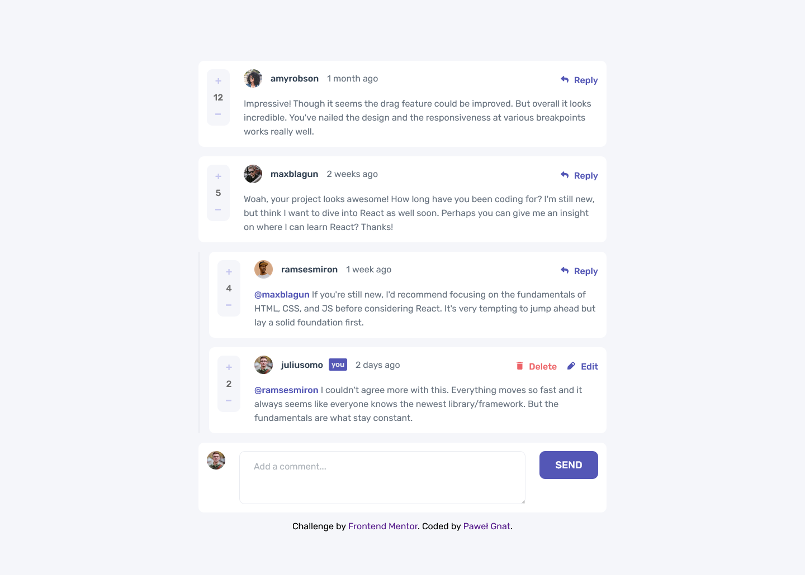

# Frontend Mentor - Interactive comments section solution

This is a solution to the [Interactive comments section challenge on Frontend Mentor](https://www.frontendmentor.io/challenges/interactive-comments-section-iG1RugEG9). Frontend Mentor challenges help you improve your coding skills by building realistic projects.

## Table of contents

- [Overview](#overview)
  - [Screenshot](#screenshot)
  - [Links](#links)
- [My process](#my-process)
  - [Built with](#built-with)
  - [What I learned](#what-i-learned)
- [Author](#author)

## Overview

### Screenshot

### Links

- Live Site URL: [Frontend Mentor Interactive comments section](https://pawel-gnat.github.io/Frontend-Mentor-Interactive-comments-section/)

## My process

Too much to write here, sorry. This challenge was tough.

### Built with

- Semantic HTML5 markup
- CSS custom properties
- Flexbox
- Grid
- Mobile-first workflow
- JavaScript

### What I learned

Coding time: 16,5 hours.

This was really a tough challenge as for intermediate level. I tried to complete it like a month before, but I found to not being ready to code it properly. Even today I left it working almost as should be, but it's definitely not DRY. I used too many if statements (I know I should change it at least to switch) and all my JS code needs a solid refactoring. I know how to tidy there on my own, but I just want to move further. I'm really exhausted by this challenge, lol. There was many DOM manipulations and logic thinking with elements.

Readme says you need a strong undestanding of JS and that's a true. Doing it with vanilla JS approach is a torture :)

## Author

- Frontend Mentor - [@Pawel-Gnat](https://www.frontendmentor.io/profile/Pawel-Gnat)
